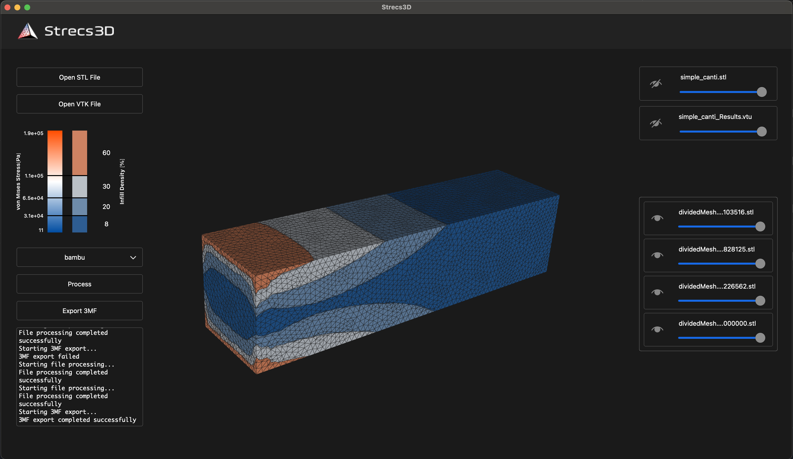

# Strecs3D

[](https://github.com/your-username/Strecs3D)
[](LICENSE)
[](CMakeLists.txt)

## 概要

Strecs3Dは、構造解析結果に基づいて3Dプリント用の効率化されたインフィルを生成する前処理ソフトウェアです。力がかかる部分には密なインフィル、かからない部分には疎なインフィルを自動的に設定し、材料の節約と強度の最適化を両立させます。
<br>



### 主な機能

- **構造解析結果の可視化**: VTKファイルから応力分布を読み込み、3D表示
- **応力ベースの領域分割**: 応力閾値に基づいて3Dモデルを自動分割
- **密度可変インフィル生成**: 応力レベルに応じたインフィル密度の設定
- **スライサー対応**: Cura、Bambu Studioに対応した3MFファイル出力

## システム要件

### 対応OS
- **Windows 11** (64bit)
- **macOS 10.15以降**

### 必要環境
- **RAM**: 8GB以上推奨
- **ストレージ**: 1GB以上の空き容量

## インストール方法

### 1. リリース版のダウンロード

1. [GitHub Releases](https://github.com/your-username/Strecs3D/releases)にアクセス
2. お使いのOSに応じて以下をダウンロード：
   - **Windows**: `Strecs3D-Windows-Installer.exe`
   - **macOS**: `Strecs3D-macOS.dmg`

### 2. インストール

#### Windows
1. ダウンロードしたインストーラーを実行
2. インストールウィザードの指示に従ってインストール
3. デスクトップにショートカットが作成されます

#### macOS
1. ダウンロードしたDMGファイルを開く
2. Strecs3DアプリケーションをApplicationsフォルダにドラッグ&ドロップ

## 使用方法

### 1. ファイルの準備

#### 入力ファイル
- **STLファイル**: CADソフトから出力された3Dモデル（バイナリ形式のみ対応）
- **VTUファイル**: 構造解析ソフトから出力された解析結果

#### 対応ファイル形式
- **入力**: `.stl` (バイナリ), `.vtu`
- **出力**: `.3mf`

### 2. 基本的なワークフロー

#### Step 1: ファイルのインポート
1. Strecs3Dを起動
2. **STLファイル**を「Open Stl File」で選択
3. **VTUファイル**を同様にインポート

#### Step 2: 応力閾値の設定
1. 応力分布を確認
2. 密度スライダーを使用して各応力レベルでのインフィル密度を設定
3. プレビューで結果を確認

#### Step 3: スライサーの選択
- **Cura**: 標準的な3MF出力
- **Bambu Studio**: Bambu Studio専用の最適化された出力

#### Step 4: 処理実行
1. **Process**ボタンをクリック
2. 領域分割の確認
3. **Export 3MF**でファイル出力

#### Step 5: スライサーでの使用
1. 出力された3MFファイルをスライサーで読み込み
2. 通常通りスライス処理を実行
3. 応力に応じた最適化されたインフィルパターンが生成されます

### 3. 高度な設定

#### 応力閾値の調整
- 複数の応力レベルを設定可能
- 各レベルでのインフィル密度を個別に調整
- リアルタイムプレビューで効果を確認

#### 可視化オプション
- 応力分布の色分け表示
- 分割された領域の個別表示
- 透明度調整による内部構造の確認

## サンプルファイル

`examples/`フォルダに以下のサンプルが含まれています：

- **bracket/**: ブラケットモデル
- **cantilever/**: 片持ち梁モデル
- **drone/**: ドローン部品モデル
- **tablet_stand/**: タブレットスタンドモデル

各サンプルにはSTLファイルとVTUファイルが含まれており、ソフトウェアの動作確認に使用できます。

## 技術仕様

### アーキテクチャ
- **フレームワーク**: Qt 6
- **3D可視化**: VTK (Visualization Toolkit)
- **ファイル処理**: lib3mf
- **ビルドシステム**: CMake

### 主要コンポーネント
- **ApplicationController**: メインアプリケーション制御
- **ProcessPipeline**: ファイル処理パイプライン
- **VisualizationManager**: 3D可視化管理
- **ExportManager**: 3MFファイル出力管理
- **VtkProcessor**: VTKファイル処理
- **Lib3mfProcessor**: 3MFファイル処理

### 対応スライサー
- **Cura**: 標準3MF形式
- **Bambu Studio**: 専用最適化形式

## トラブルシューティング

### よくある問題

#### Q: STLファイルが読み込めない
A: バイナリ形式のSTLファイルのみ対応しています。ASCII形式の場合は、CADソフトでバイナリ形式に変換してください。

#### Q: VTUファイルが読み込めない
A: VTK形式のVTUファイルであることを確認してください。他の形式の場合は、VTK形式に変換が必要です。

#### Q: 3MFファイルがスライサーで読み込めない
A: 使用しているスライサーが3MF形式に対応していることを確認してください。

#### Q: 処理中にエラーが発生する
A: ファイルサイズが大きすぎる可能性があります。メモリ使用量を確認し、必要に応じてモデルを簡略化してください。

## 開発者向け情報

### プロジェクト構造
```
Strecs3D/
├── core/           # コア処理ロジック
├── UI/            # ユーザーインターフェース
├── utils/         # ユーティリティ関数
├── resources/     # リソースファイル
├── examples/      # サンプルファイル
└── cmake/         # ビルド設定
```

###  ソースからのビルド

#### 必要な依存関係
- **CMake** 3.16以上
- **Qt** 6.0以上
- **VTK** 9.0以上
- **lib3mf** 2.0以上
- **vcpkg** (パッケージ管理)

#### ビルド手順

```bash
# リポジトリのクローン
git clone https://github.com/your-username/Strecs3D.git
cd Strecs3D

# ビルドディレクトリの作成
mkdir build && cd build

# CMakeでビルド設定
cmake ..

# ビルド実行
cmake --build . --config Release
```


## ライセンス

このプロジェクトはBSD 3-Clauseライセンスの下で公開されています。詳細は[LICENSE](LICENSE)ファイルを参照してください。

## サポート

- **Issues**: [GitHub Issues](https://github.com/tomohiron907/Strecs3D/issues)
- **Discussions**: [GitHub Discussions](https://github.com/tomohiron907/Strecs3D/discussions)
- **Wiki**: [GitHub Wiki](https://github.com/tomohiron907/Strecs3D/wiki)

## 更新履歴

### v1.0.0
- 初回リリース
- STL/VTUファイル対応
- Cura/Bambu Studio対応
- 基本的な応力ベース分割機能

---

## 言語サポート

- [English](README.md)
- [日本語](README_JP.md) (現在) 